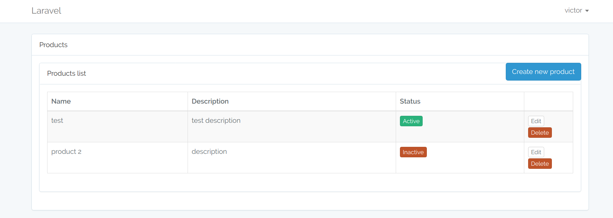

## Laravel 5.5 + Vue.js Simple Product CRUD

Laravel working with Vue.js.

---

### Instructions

- Clone the repository with __git clone__
- Copy __.env.example__ file to __.env__ and edit database credentials
- Run __composer install__
- Run __php artisan key:generate__
- Run __php artisan migrate__

---